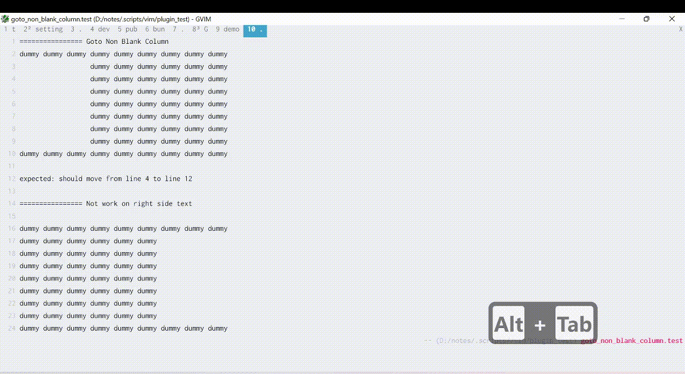

# Feature
This plugin enables you to move easier in vim.
When you press `<a-j>` / `<a-k>` it will move cursor up/down until it collide with another text

Limitation: can only works on the left side of the text

#### Demo

# Installation
## Pathogen

Clone this repo to your plugin folder (usually in $HOME/.vim/bundle/)

